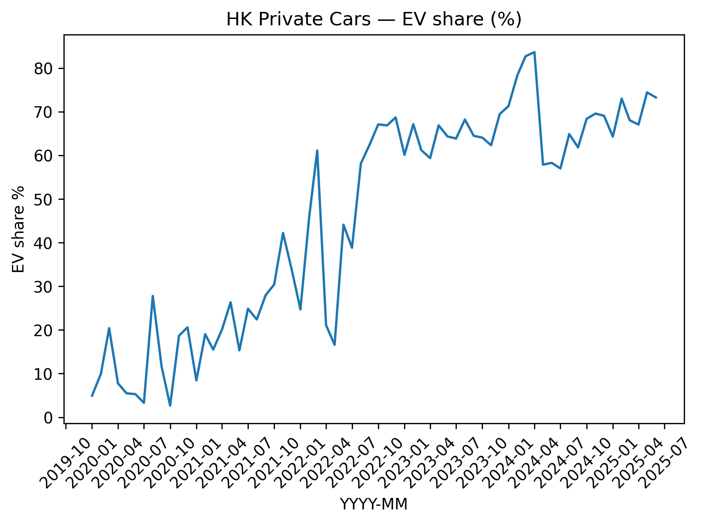
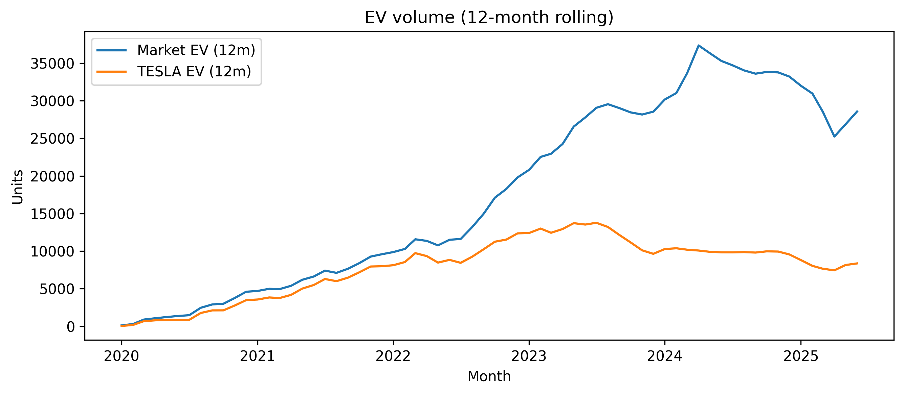
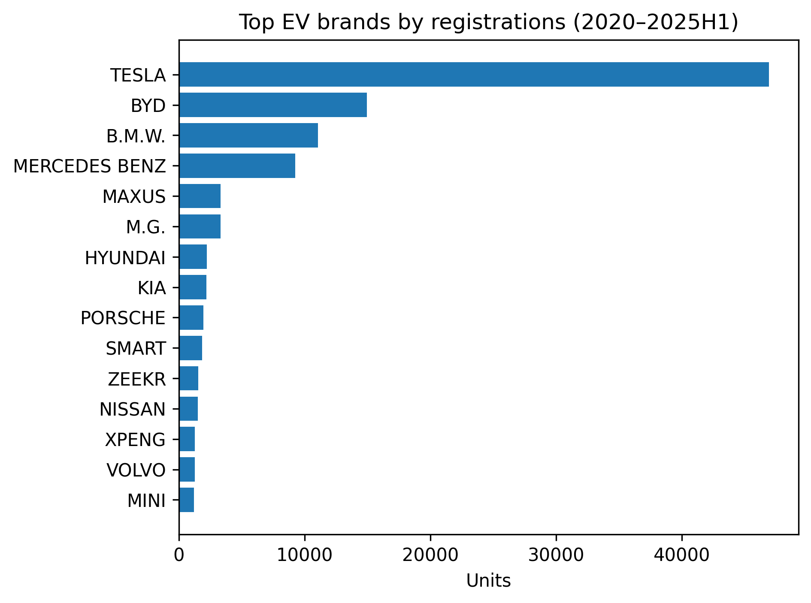

# HK Private Cars 2020–2025 — EV Adoption & Brand Shares

A compact portfolio project that scrapes, cleans, and analyzes Hong Kong *private car first registrations* (2020–2025), with a focus on **EV adoption** and **brand performance**.

**What’s inside**

- **Python**: requests + pandas for scraping & cleaning, matplotlib for charts  
- **SQL**: ad-hoc analysis with DuckDB/SQLite (via `pandas.read_sql_query`)  
- **Visualization**: ready-to-publish images; Tableau recipes included  
- **Reproducible notebooks**: end-to-end from raw HTML to insights

---

## Highlights

|  |  |
|---|---|
| **EV share — 2020–2025** | **EV volume (12-month rolling)** |
|  |  |
| **Top brands (2025 H1)** |  |
|  |  |

**Quick takeaways**
- EV share rose rapidly post-2021, with a brief cooldown and re-acceleration in 2025H1.  
- The 12-month rolling series smooths monthly volatility and shows the structural uptrend.  
- 2025H1 brand leaderboard is led by **BYD**, **TESLA**, and **TOYOTA** (registrations).

---

## Project structure
